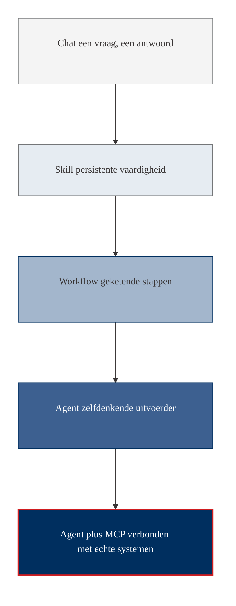
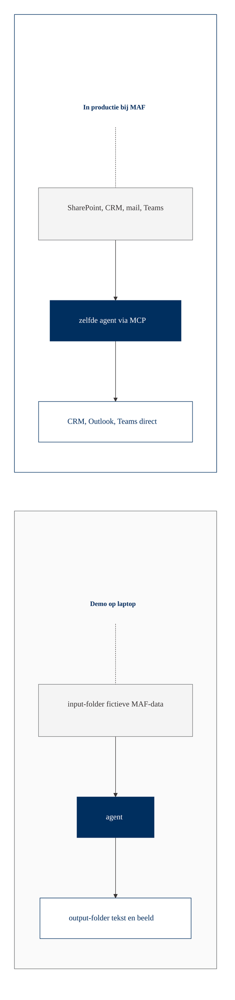

# Voorbij chat: waar staat AI nu echt?

Eén A4 om aan het begin van elke sessie kort te bespreken. Voor MAF-publiek dat Copilot Chat kent en wil weten wat er nog meer is.

## De vijf begrippen

### Chat
Een gesprek met AI. Vraag stellen, antwoord krijgen. Als je het venster sluit begint het volgende gesprek weer leeg.

**Voorbeeld voor MAF:** in Copilot Chat vragen "herschrijf deze mail in een vriendelijker toon" en het antwoord kopiëren naar Outlook.

### Skill
Een vaardigheid die je een AI permanent toevoegt, zodat je niet elke keer dezelfde instructies hoeft te herhalen. In ChatGPT heet dit een Custom GPT, in Claude een Project, in Copilot een Copilot Studio-agent.

**Voorbeeld voor MAF:** een Custom GPT die de MAF-toon kent en altijd in die toon schrijft, zodat je niet meer hoeft uit te leggen wie MAF is en hoe MAF communiceert.

### Workflow
Een keten van stappen die automatisch loopt als iets gebeurt. AI is daarin één stap. Tools: Power Automate (Microsoft), n8n, Make, Zapier.

**Voorbeeld voor MAF:** als er een nieuwe donateurmail binnenkomt, vat de mail samen, plaats de samenvatting in het CRM, stuur een bevestigingsmail terug.

### Agent
AI die zelfstandig meerdere stappen kiest en uitvoert om een doel te bereiken. Slimmer dan een workflow want hij beslist tijdens het werk welke stap nu nodig is.

**Voorbeeld voor MAF:** een agent die een gespreksverslag leest en zelf bepaalt of er een actiepuntenlijst, CRM-notitie of follow-up-mail moet komen, en het allemaal maakt zonder dat jij hem stap voor stap stuurt.

### MCP (Model Context Protocol)
Een standaard aansluiting waarmee een AI rechtstreeks aan jouw systemen kan praten: SharePoint, Outlook, een database, een API. Vergelijk met USB-C: één aansluiting, oneindig veel apparaten.

**Voorbeeld voor MAF:** een agent met MCP-koppeling op het CRM die elke maandag een lijst maakt van donateurs die deze week aandacht verdienen, en die rechtstreeks in je Teams-kanaal plaatst.

## De optelsom in één regel per niveau

- **Chat:** AI praat met je.
- **Skill:** AI leer je iets blijvend.
- **Workflow:** een keten van stappen waarin AI één stap is.
- **Agent:** AI bepaalt de keten zelf.
- **Agent + MCP:** de agent is verbonden met jouw echte systemen.

## Visueel

## Waar staat MAF nu, en waar gaan de demo's heen?

Vandaag gebruikt MAF vooral **chat** (Copilot Chat, soms ChatGPT). De demo's van vandaag zitten op het **agent**-niveau: zelfstandige uitvoerders die meerdere bestanden lezen, denken, en meerdere bestanden schrijven.

Voor de dag van vandaag draaien de agents op fictieve MAF-data in folders op de laptop. In productie zou diezelfde agent via MCP rechtstreeks aan SharePoint, het CRM, Outlook en Teams aansluiten. Dat is de stap naar **agent + MCP**.

## Demo versus productie (visueel)

De agent-definitie blijft hetzelfde. Alleen de aansluiting verandert van een lokale folder naar de echte MAF-systemen. Dat is het verschil tussen "we doen vandaag een demo" en "dit draait dagelijks in productie".
