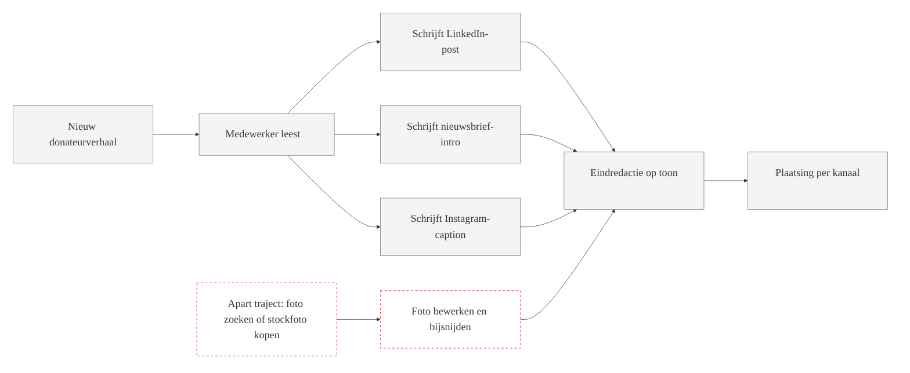
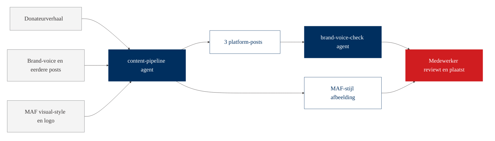
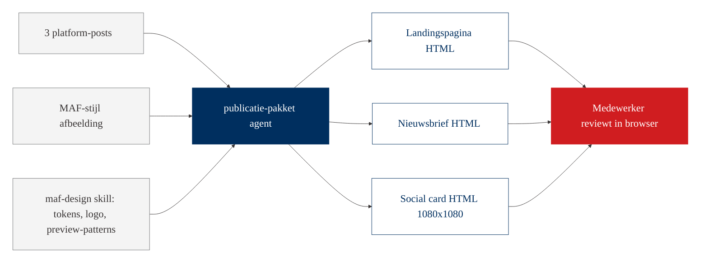
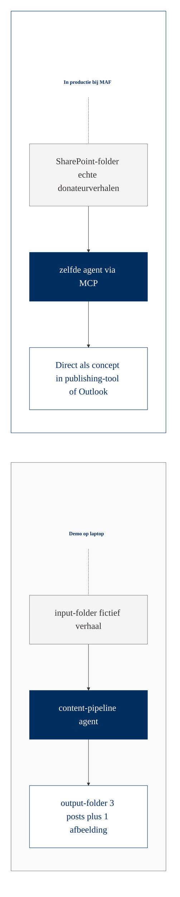

# Workflow-visualisatie: Marketing en Digital Innovation

Drie diagrammen om op groot scherm te tonen tijdens de sessie. Eerst de huidige situatie. Vraag het team of het klopt. Daarna de met-agent situatie als contrast. Tot slot, als de tijd het toelaat, de uitbreiding met het publicatie-pakket via de maf-design skill.

## Huidige situatie

Vraag aan het team: herken je dit? Hoeveel tijd zit hier in een gemiddeld verhaal?

## Met agent

Wat verandert: één invoer, drie tekstposts plus passende afbeelding, plus toon-controle. Medewerker doet review en publicatie. Inhoudelijk werk blijft mens. Herhaalwerk verdwijnt.

> Bij de live demo maakt de agent drie aparte bestanden (LinkedIn, nieuwsbrief, Instagram) plus een PNG. Het diagram vat dat samen als "3 platform-posts" plus "MAF-stijl afbeelding" om leesbaar te blijven op groot scherm.

## Met publicatie-pakket erbij

Wat er bij komt: dezelfde drie tekstposts en dezelfde afbeelding gaan door een tweede agent die met de maf-design skill drie publicatie-klare HTML-artefacten maakt. Geen ontwerper, geen CMS-werk vooraf, alles in MAF-huisstijl. De medewerker reviewt en publiceert. Voor MAF is dit het bewijs van schaal: een verhaal genereert een complete brand-consistente uitgavenset, en deze laatste stap valt later weg achter een knop in productie.

## Brug naar productie

Hetzelfde agent-script. Andere aansluiting. Dat is de stap van pakket A (Quick Wins Sprint) naar pakket B (Workflow Implementation).
