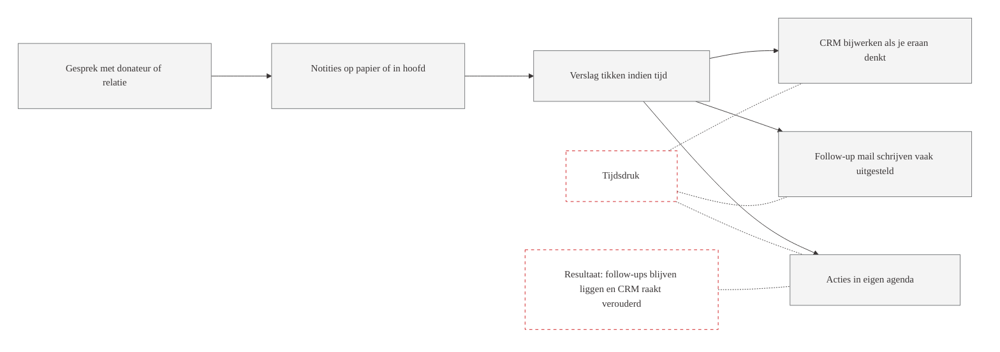
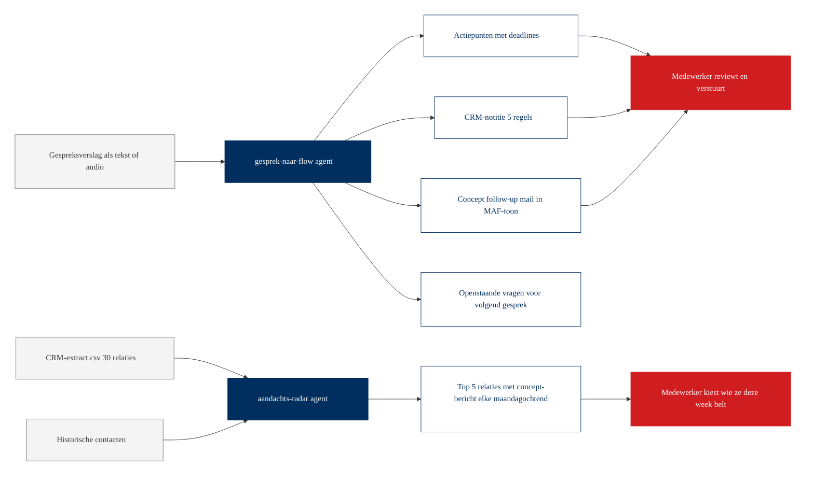
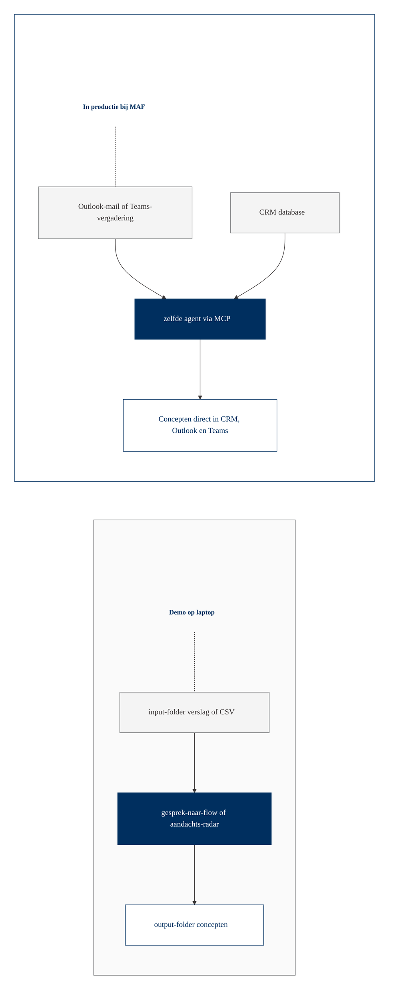

# Workflow-visualisatie: Relatiebeheer

Twee diagrammen om op groot scherm te tonen tijdens de sessie. Eerst de huidige situatie, dan met-agent.

## Huidige situatie

Vraag aan het team: hoeveel gesprekken zijn de afgelopen maand zo niet helemaal afgerond?

## Met agent

Wat verandert: alles wat in de huidige situatie kan blijven liggen, krijgt nu een concept-uitvoer die de medewerker alleen nog hoeft te reviewen. De aandachts-radar is een tweede agent die proactief signaleert wie aandacht verdient.

## Brug naar productie

In productie zit het CRM aangesloten (via MCP-connector of API), en wordt elke maandag automatisch een top-5 aangeleverd in de Teams-chat van de relatiebeheerder. Dezelfde agent, andere aansluiting.
