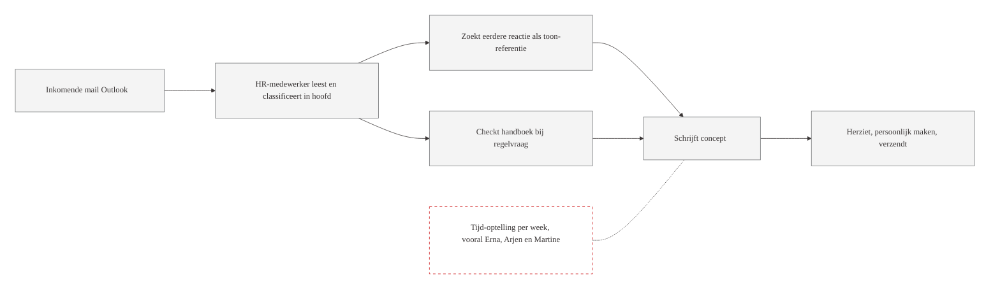
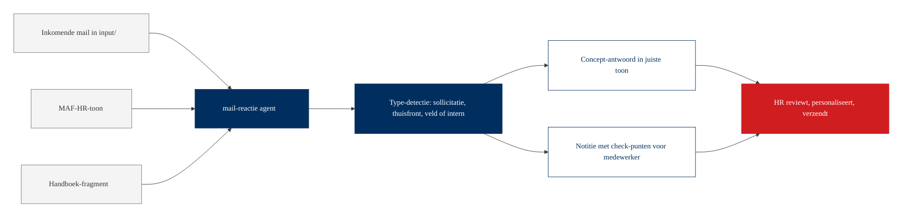
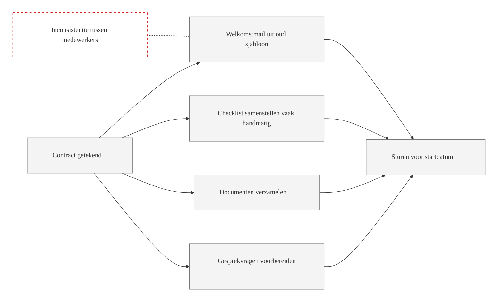
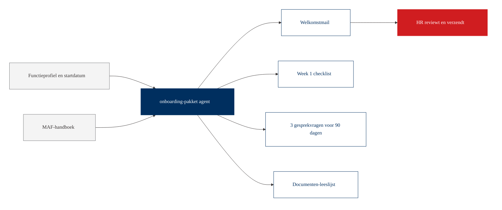
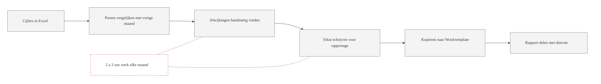
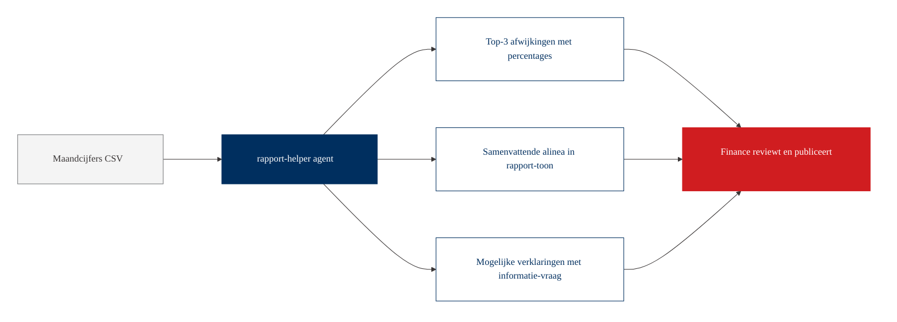
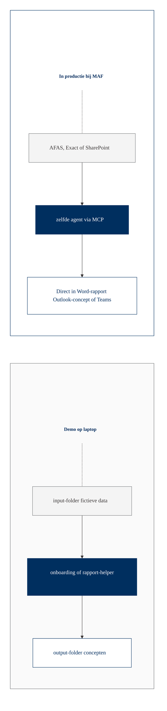

# Workflow-visualisatie: HR en Financien

Per sub-team een eigen huidige situatie en met-agent diagram. Toon op groot scherm bij de start van de sessie, kies in de mining-fase welke je verder uitwerkt. Primair vandaag: HR-mail-stroom (op basis van Thamar's intake).

## HR-huidige situatie: mail-stroom

Vraag aan het team: herken je dit, hoeveel mails per week vallen onder dit patroon?

## HR met agent: mail-stroom

Wat verandert: de agent leest de toon-richtlijn en het handboek elke keer opnieuw, kalibreert het concept op het juiste type, en levert daarnaast een notitie waarin hij zelf benoemt wat de medewerker nog moet checken. Mens reviewt en verzendt, oordeel blijft bij mens.

## HR-huidige situatie: onboarding

## HR met agent: onboarding

## Finance-huidige situatie: maandrapportage

## Finance met agent: maandrapportage

## Brug naar productie (HR en Finance gecombineerd)

In productie zit het agent-script aangesloten op het HR-systeem of de finance-applicatie, en wordt de output direct als concept in de juiste tool geplaatst.
