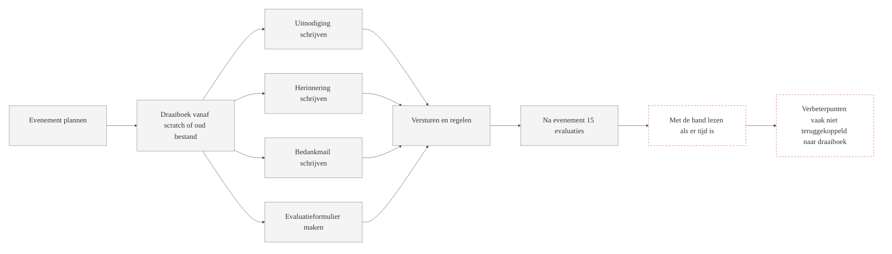
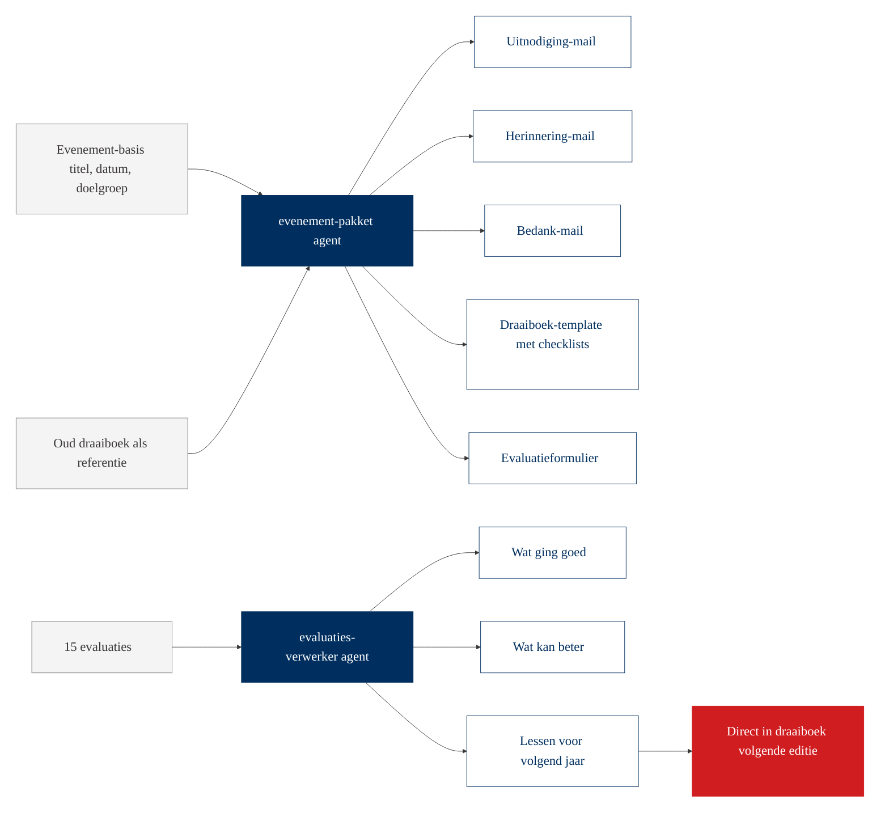
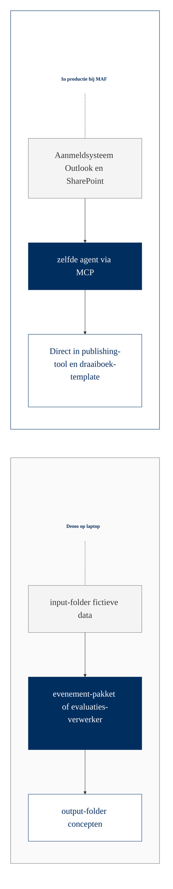

# Workflow-visualisatie: Evenementen

Twee diagrammen voor op groot scherm.

## Huidige situatie

Vraag het team: welke fase van een evenement kost de meeste tijd? Wat blijft het vaakst liggen?

## Met agent

## Brug naar productie

In productie zit het aanmeldsysteem aangesloten, en wordt het volledige communicatiepakket automatisch klaargezet zodra een nieuw evenement in de agenda komt. Evaluaties worden automatisch verwerkt en op een verbeterlijst gezet.
